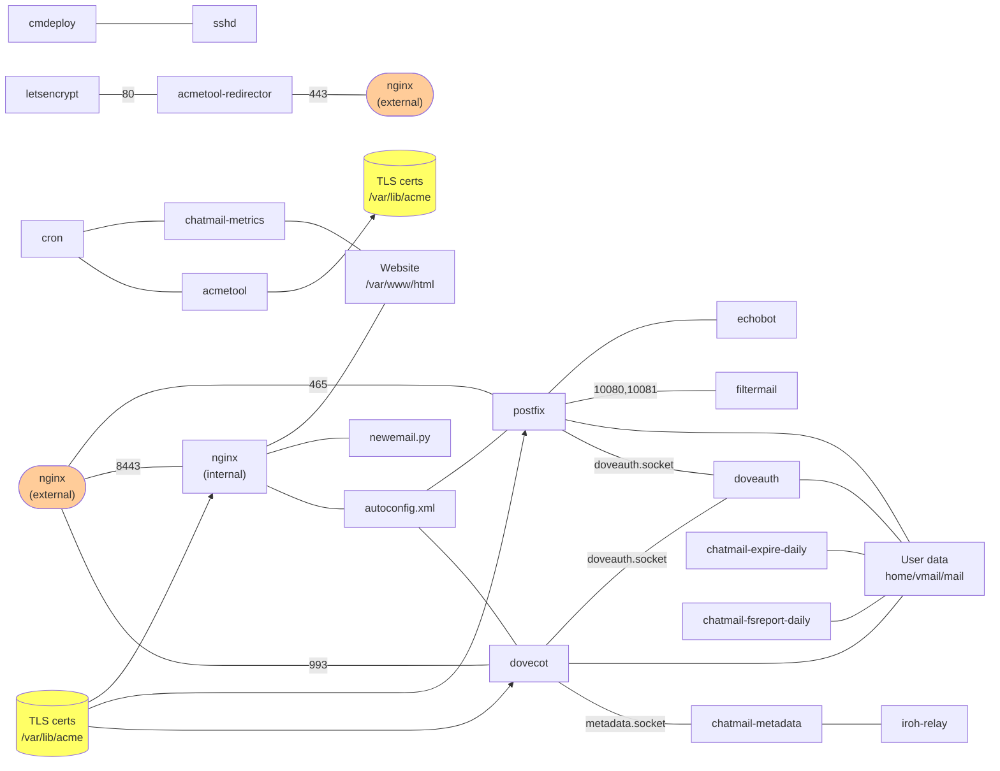

## Chatmail Server

This diagram shows components of the chatmail server; this is a draft
overview as of mid-August 2025:

The edges in this graph should not be taken too literally; they
reflect some sort of communication path or dependency relationship
between components of the chatmail server.

## cmdeploy

cmdeploy is a Python program that uses the pyinfra library to deploy
chatmail servers, with all the necessary software, configuration, and
services.  The deployment process performs three primary types of operation:

1. Installation of software, universal across all deployments.
2. Configuration of software, with deploy-specific variations.
3. Activation of services.

The process is implemented through a family of "deployer" objects
which all derive from a common `Deployer` base class, defined in
[deployer.py](cmdeploy/src/cmdeploy/deployer.py).  Each object
provides implementation methods for the three stages -- install,
configure, and activate.  The top-level procedure in
`deploy_chatmail()` calls these methods for all the deployer objects,
first calling all the install methods, then the configure methods,
then the activate methods.

The base class also implements support for a CMDEPLOY_STAGES
environment variable, which allows limiting the process to specific
stages.  Note that some deployers are stateful between the stages
(this is one reason why they are implemented as objects), and that
state will not get propagated between stages when run in separate
invocations of cmdeploy.  This environment variable is intended for
use in future revisions to support building Docker images with
software pre-installed, and configuration of containers at run time
from environmnet variables.

The `install_impl()` method for the deployer classes is static, to
ensure that it does not rely on any object state, in particular, the
configuration details of the deployment.  This helps ensure that all
install methods are suitable for running as part of a container image
build.

Operations that start services for systemd-based deployments should
only be called from the `activate_impl()` methods.  These methods will
not be called in non-systemd container environments.

### Deployer objects

One might ask why the deployers are implemented as object classes, as
opposed to callable functions or the like.  There are various reasons
why objects are a good fit for the deployment process.

1. Objects provide a way to organize the install, configure, and
deploy operations for each component that is installed, supporting a
"driver" type of pattern.  This could be implemented in other ways
without objects, such as function jump tables, but objects provide a
clean and formalized way to do essentially the same thing.

2. Class inheritance provides a natural way to define
component-specific operations for the various stages of deployment, by
overriding the no-op stub methods in the base class.  The base class
handles policy decisions about which stages are to be executed,
ensuring consistent handling of the stages in a central location.

3. Some of the components track state between stages, basing decisions
like whether to restart a service on whether the software or
configuration of that service was changed in an earlier stage.
Keeping track of state between method calls is an ideal use case for
objects.
