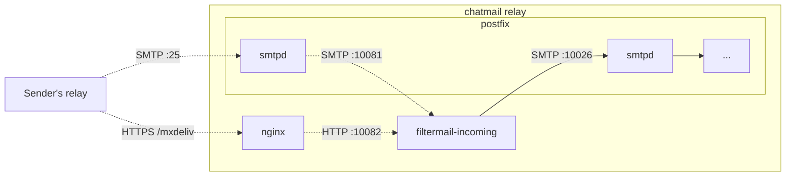
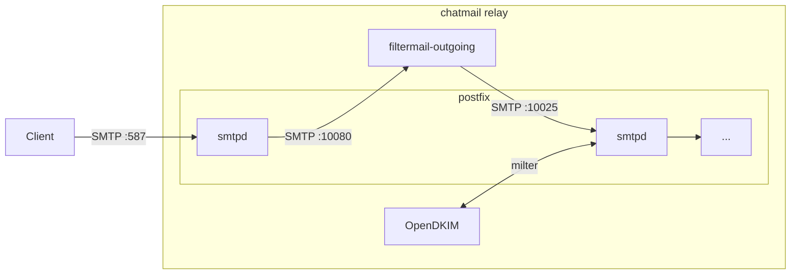
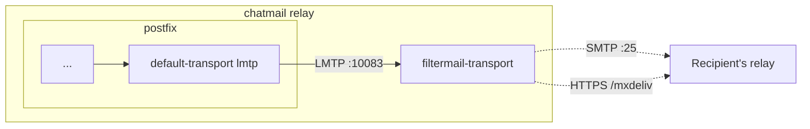

# filtermail

A postfix smtpd proxy filter used by [chatmail relay](https://github.com/chatmail/relay).

Filtermail is a fast, minimal and secure Rust-based SMTP before-queue filter.
By acting as a protocol-aware proxy for incoming and outgoing messages,
it enforces mandatory end-to-end encryption,
performs DKIM verification,
and handles per-sender rate limiting.

## Usage

```plain
filtermail <config> (incoming|outgoing|transport)
```
where `<config>` is a path to `chatmail.ini` configuration file.

Filtermail can be used in `incoming`, `outgoing` or `transport` mode.

### Incoming mode



Filtermail in incoming mode acts as a proxy filter
for messages received from remote MTAs and performs following steps:

1. Rejects messages if `DATA` exceeds configured message size limit.
2. Rejects messages that do not meet at least one of the following criteria:
    - PGP encrypted,
    - securejoin message,
    - mailer-daemon message,
    - all recipients allow cleartext
      (`enforceE2EEincoming` is not present in their mailbox directory).
3. If `MAIL FROM` doesn't match `From` header,
   the address is removed from `MAIL FROM` on reinjection
   (prevents bounces to possibly spoofed `MAIL FROM`).
4. Checks message origin,
   depending on address type:
    - **domain** - performs a strict DKIM verification and domain alignment check
      (domain of address from `From` header must exactly match the DKIM signature domain),
      rejecting messages that fail.
    - **domain-literal (IP address)** - currently no-op.
5. In case of a DKIM failure,
   the message is saved to `/tmp/filtermail-rejected/dkim-verify` directory for later inspection.

In contrast to outgoing mode, incoming mode starts with not only SMTP but also HTTP listener.
Built-in HTTP server doesn't handle TLS, and should be placed behind a TLS-terminating reverse proxy.

### Outgoing mode



Filtermail in outgoing mode acts as a proxy filter
for messages received from clients and performs following steps:

1. Rejects messages at `MAIL FROM` stage if the address exceeded rate limit.
2. Rejects messages if `DATA` exceeds configured message size limit.
3. Rejects messages which `From` header address does not match one in `MAIL FROM`.
4. Rejects messages that do not meet at least one of the following criteria:
    - PGP encrypted,
    - securejoin message,
    - self-sent Autocrypt Setup Message,

### Transport mode



Filtermail in transport mode is used for final delivery to remote MTAs.
As opposed to incoming/outgoing, it accepts connections from postfix over LMTP instead of SMTP,
to allow returning per-recipient status back to postfix.
Received message is split per-domain and sent to recipients' MX servers over HTTP and SMTP,
enforcing TLS.
As opposed to postfix, IPv4 and IPv6 connections are tried in parallel and first successful connection is used.
HTTP delivery channel is preferred,
and SMTP is used only if HTTP delivery fails.

## Configuration

### chatmail.ini

Filtermail shares the same configuration file as chatmail relay,
but implements a custom parser that only requires a small subset of configuration options:

- `filtermail_smtp_port` - port to listen on in outgoing mode,
  defaults to `10080`.
- `filtermail_smtp_port_incoming` - SMTP port to listen on in incoming mode,
  defaults to `10081`.
- `filtermail_http_port_incoming` - HTTP port to listen on in incoming mode,
  defaults to `10082`.
- `filtermail_lmtp_port_transport` - port to listen on in transport mode,
  defaults to `10083`.
- `postfix_reinject_port` - port to reinject messages to postfix in outgoing mode,
  defaults to `10025`.
- `postfix_reinject_port_incoming` - port to reinject messages to postfix in incoming mode,
  defaults to `10026`.
- `max_message_size` - maximum allowed message size in bytes,
  defaults to `31457280` (30 MiB).
- `max_user_send_per_minute` - email sending rate per user and minute,
  defaults to `60`.
- `max_user_send_burst_size` - per-user max burst size for sending rate limiting (GCRA bucket capacity),
  defaults to `10`.
- `mail_domain` - domain name used in email addresses.
- `mailboxes_dir` - path to mailboxes directory,
  defaults to `/home/vmail/mail/<mail_domain>`.

The following options are Filtermail-specific,
they are not read by other chatmail relay components
and usually do not need to be set at all:

- `filtermail_host` - IP address to listen on,
  defaults to `127.0.0.1`.
- `postfix_host` - hostname or IP address where postfix is set up,
  a host is resolved only on Filtermail startup,
  useful in case MTA runs somewhere outside of localhost,
  defaults to `127.0.0.1`.

### Environment variables

Additional options that can be set using environment variables:

- `RUST_LOG` - set log level,
  defaults to `info`.
- `FILTERMAIL_SKIP_DKIM` - completely skip DKIM verification;
  only for testing purposes and not recommended for production use,
  defaults to `0`.

## Usage outside of chatmail relay

**Filtermail development is focused on supporting it as a systemd service used by chatmail relay.**
Although unsupported, it may still work outside of this context or even without postfix,
with few considerations:

- Filtermail expects to receive messages from trusted clients,
  and thus should not listen on ports exposed directly to the internet.
- Issues outside of chatmail relay context are not necessarily considered bugs;
  PRs fixing them are not guaranteed to be accepted.
  (Trivial changes may still be considered,
  please open an issue to discuss any such changes before working on them).


## Releases

Filtermail is distributed as a statically linked linux binary,
available for `x86_64` and `aarch64` architectures.

Binaries are available on the [releases page](https://github.com/chatmail/filtermail/releases).

## License

Code licensed under [MIT](LICENSE).

Binary releases of `filtermail` link with `viadkim`
and are thus subject to the [GPL-3.0-or-later](LICENSE-GPL).
